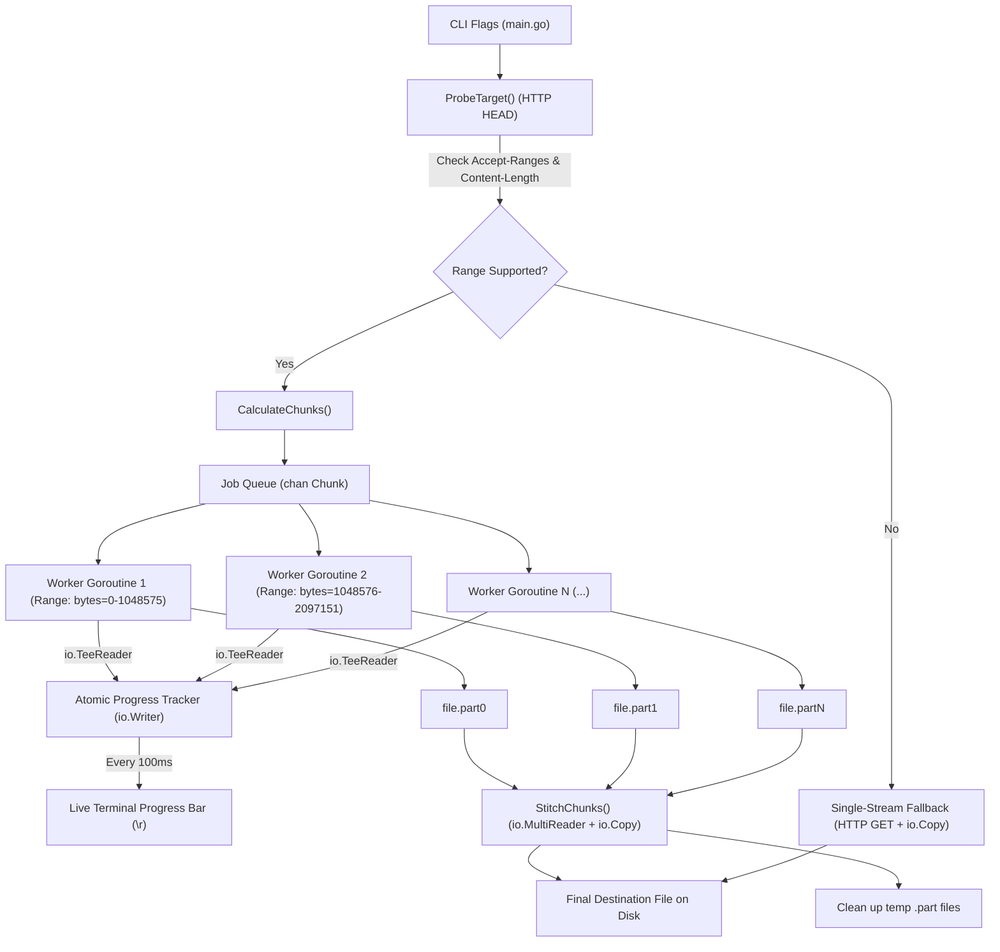
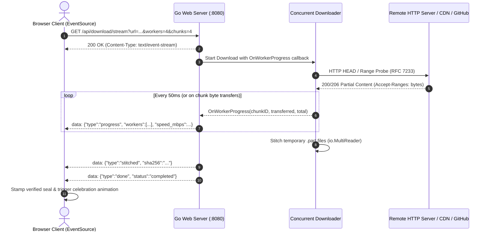

# Beam (`beam`) — High-Throughput Concurrent Byte-Range Streaming Engine

A production-grade, lightweight concurrent file downloader inspired by `aria2` and `curl`, written from scratch in Go using standard library primitives.

---

## 🚀 Overview

Standard single-stream HTTP downloads are frequently throttled on a per-connection basis by remote servers and ISPs, underutilizing available network bandwidth. **`beam`** solves this by:
1. Probing the remote server for RFC 7233 `Accept-Ranges` byte-range capabilities.
2. Mathematically partitioning the payload across discrete byte ranges.
3. Spawning a bounded worker pool of Goroutines that pull chunks concurrently over independent TCP streams.
4. Assembling and stitching the downloaded parts into the target destination using zero whole-file memory allocation.

---

## 🏛️ Architecture & Data Flow



---

## 🔑 Key Engineering Highlights

### 1. Zero-RAM Streaming
- Rather than buffering whole chunks (e.g. 500 MB) into memory buffers (`[]byte`), data is streamed directly from HTTP response bodies to disk using `io.Copy`.
- `io.Copy` operates with a fixed internal 32 KB buffer, ensuring memory footprint remains negligible regardless of file size (tested with multi-gigabyte payloads).

### 2. Lock-Free Hierarchical Atomic Progress Dashboard
- Multiple worker goroutines report transferred bytes simultaneously through dedicated `WorkerTracker` instances via `io.TeeReader`.
- Writes atomically increment both the worker's chunk byte counter and the master aggregate counter using lock-free `sync/atomic.Int64.Add`.
- Computes real-time per-worker status, overall percentage, aggregate transfer speed (MB/s), and overall ETA.
- Renders a multi-line terminal dashboard using ANSI cursor movements (`\033[<N>A`) and line clearing (`\r\033[2K`), giving live visual feedback for every worker in the pool.

### 3. Bounded Concurrency Worker Pool
- Decouples task volume from resource consumption.
- If a file is split into 100 chunks, a bounded pool of 4 workers consumes jobs sequentially from a buffered Go channel (`chan Chunk`), avoiding socket exhaustion and server rate-limiting.

### 4. Zero-RAM Multi-File Stitching
- Assembles downloaded parts into the target destination using `io.MultiReader`.
- All temporary chunk handles are systematically tracked and explicitly closed before invoking `os.Remove`, avoiding OS file-lock exceptions (critical on Windows).

### 5. Graceful Single-Stream Fallback
- If a server omits `Accept-Ranges: bytes` or returns non-range status, the orchestrator detects this and seamlessly executes a single-stream fallback with full live progress tracking.

---

## 📦 Installation & Build

Compile the standalone binary using the Go toolchain:

```bash
# Build executable binary in the project directory
go build -o beam.exe ./projects/01_chunk_downloader/main.go
```

---

## 💻 CLI Usage

```bash
# Basic download (auto-derives filename from URL)
./beam.exe -url https://example.com/largefile.zip

# Custom destination file with 8 workers and 8 chunks
./beam.exe -url https://example.com/largefile.zip -o my_file.zip -w 8 -c 8
```

### Command Flags

| Flag | Type | Default | Description |
|---|---|---|---|
| `-url` | `string` | *(Required)* | Target URL of the remote file to download |
| `-o` | `string` | Auto-derived | Destination file path on local disk |
| `-w` | `int` | `4` | Number of concurrent worker Goroutines in the pool |
| `-c` | `int` | `4` | Number of byte-range chunks to divide the file into |

---

## 🌐 Real-Time Web Dashboard & SSE Streaming

`beam` includes a retro-editorial tactile web dashboard (`web/`) powered by **Server-Sent Events (SSE)** and **Anime.js**. It enables users to visually observe concurrent chunk downloading, worker thread allocation, dynamic network throughput, and Windows XP style animated byte packets streaming along curved SVG conduits directly into a destination folder in real time.



### Launching the Web Dashboard

```bash
# Run the web dashboard server
go run ./cmd/web -port 8080
```
Open **`http://localhost:8080`** in any web browser.

### Features
1. **Real-World Payloads & Presets**: Direct streaming from GitHub Releases (50 MB, 100 MB), Linux Kernel CDN (142 MB), and Go Dev (27.5 MB).
2. **Configurable Bandwidth Throttler**: Built-in Token Bucket rate limiter (1 MB/s, 3 MB/s, 5 MB/s, 10 MB/s, or Unlimited) to simulate real-world network constraints.
3. **Compact Square 2D Tracker**: Retro BitTorrent/defrag style matrix displaying discrete chunk state transitions in a minimal footprint.
2. **Per-Worker Telemetry Cards**: Watch individual worker goroutines claim chunks, stream data, and complete chunks in real time.
3. **Master Progress Track**: Real-time throughput gauge (MB/s), ETA countdown, transferred megabytes, and completion percentage.
4. **Live RFC 7233 Protocol Drawer**: Collapsible diagnostic log showing byte-range requests (`Range: bytes=X-Y`), HTTP 206 Partial Content responses, and SHA-256 verification.
5. **Zero Framework Dependencies**: Pure Vanilla ES6+ and modern CSS with custom spring animations (`cubic-bezier(0.32, 0.72, 0, 1)`), OLED `#050505` backdrop, and concentric double-bezel cards.

---

## 🧪 Testing & Data Race Verification

All components are covered by unit and integration tests using `net/http/httptest` (requiring zero external network access).

Run tests with Go's race detector enabled:

```bash
go test -v -race ./...
```

Every test verifies end-to-end cryptographic SHA-256 data integrity and zero concurrent data races.

